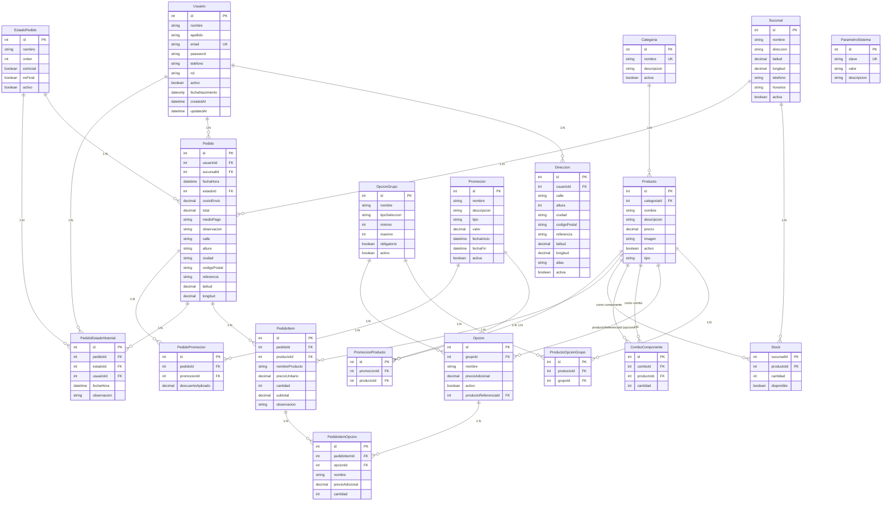

# DER — Comi-Rapi

## 1. Introducción

Este documento describe el **Diagrama Entidad-Relación (DER)** del proyecto **Comi-Rapi**.

Deriva directamente del modelo de dominio aprobado en `docs/modelo-dominio.md` (fuente de verdad) y del enunciado funcional `docs/enunciado.md`. Representa la estructura de datos prevista para la implementación con **PostgreSQL + Sequelize**, sin incluir todavía código, modelos ORM, migraciones ni rutas.

`docs/historico/analisis-inicial.md` es material histórico y no se utiliza para definir este DER.

## 2. Entidades

El DER contempla las **19 entidades** del modelo actual. Para cada una se indica su PK, atributos principales, FKs y restricciones relevantes.

### 2.1 Usuario

| Atributo          | Tipo de dato                       | Notas            |
| ----------------- | ---------------------------------- | ---------------- |
| `id`              | `INTEGER`                          | PK               |
| `nombre`          | `STRING`                           |                  |
| `apellido`        | `STRING`                           |                  |
| `email`           | `STRING`                           | UNIQUE           |
| `password`        | `STRING`                           | hash (posterior) |
| `telefono`        | `STRING`                           |                  |
| `rol`             | `ENUM('CLIENTE', 'ADMINISTRADOR')` |                  |
| `activo`          | `BOOLEAN`                          |                  |
| `fechaNacimiento` | `DATEONLY`                         | Opcional         |
| `createdAt`       | `DATE`                             |                  |
| `updatedAt`       | `DATE`                             |                  |

- PK: `id`
- UNIQUE: `email`
- `edad` es un atributo derivado/calculado a partir de `fechaNacimiento`; **no** se persiste en la base de datos.

### 2.2 Direccion

| Atributo       | Tipo de dato    | Notas             |
| -------------- | --------------- | ----------------- |
| `id`           | `INTEGER`       | PK                |
| `usuarioId`    | `INTEGER`       | FK → `Usuario.id` |
| `calle`        | `STRING`        |                   |
| `altura`       | `INTEGER`       |                   |
| `ciudad`       | `STRING`        |                   |
| `codigoPostal` | `STRING`        |                   |
| `referencia`   | `TEXT`          | Opcional          |
| `latitud`      | `DECIMAL(10,7)` | Opcional          |
| `longitud`     | `DECIMAL(10,7)` | Opcional          |
| `alias`        | `STRING`        | Opcional          |
| `activa`       | `BOOLEAN`       |                   |

- PK: `id`
- FK: `usuarioId → Usuario.id`

### 2.3 Sucursal

| Atributo    | Tipo de dato    | Notas                             |
| ----------- | --------------- | --------------------------------- |
| `id`        | `INTEGER`       | PK                                |
| `nombre`    | `STRING`        |                                   |
| `direccion` | `STRING`        |                                   |
| `latitud`   | `DECIMAL(10,7)` |                                   |
| `longitud`  | `DECIMAL(10,7)` |                                   |
| `telefono`  | `STRING`        |                                   |
| `horarios`  | `STRING`        | información propia de la sucursal |
| `activa`    | `BOOLEAN`       |                                   |

- PK: `id`
- Sin FKs. `horarios` no es una entidad independiente.

### 2.4 Categoria

| Atributo      | Tipo de dato | Notas  |
| ------------- | ------------ | ------ |
| `id`          | `INTEGER`    | PK     |
| `nombre`      | `STRING`     | UNIQUE |
| `descripcion` | `TEXT`       |        |
| `activa`      | `BOOLEAN`    |        |

- PK: `id`
- UNIQUE: `nombre`

### 2.5 Producto

| Atributo      | Tipo de dato                | Notas               |
| ------------- | --------------------------- | ------------------- |
| `id`          | `INTEGER`                   | PK                  |
| `categoriaId` | `INTEGER`                   | FK → `Categoria.id` |
| `nombre`      | `STRING`                    |                     |
| `descripcion` | `TEXT`                      |                     |
| `precio`      | `DECIMAL(10,2)`             | precio vigente      |
| `imagen`      | `STRING`                    |                     |
| `activo`      | `BOOLEAN`                   |                     |
| `tipo`        | `ENUM('PRODUCTO', 'COMBO')` |                     |

- PK: `id`
- FK: `categoriaId → Categoria.id`

### 2.6 ComboComponente

| Atributo     | Tipo de dato | Notas              |
| ------------ | ------------ | ------------------ |
| `id`         | `INTEGER`    | PK                 |
| `comboId`    | `INTEGER`    | FK → `Producto.id` |
| `productoId` | `INTEGER`    | FK → `Producto.id` |
| `cantidad`   | `INTEGER`    |                    |

- PK: `id`
- FK: `comboId → Producto.id` (producto tipo `COMBO`)
- FK: `productoId → Producto.id` (producto componente)

### 2.7 OpcionGrupo

| Atributo        | Tipo de dato                | Notas |
| --------------- | --------------------------- | ----- |
| `id`            | `INTEGER`                   | PK    |
| `nombre`        | `STRING`                    |       |
| `tipoSeleccion` | `ENUM('UNICA', 'MULTIPLE')` |       |
| `minimo`        | `INTEGER`                   |       |
| `maximo`        | `INTEGER`                   |       |
| `obligatorio`   | `BOOLEAN`                   |       |
| `activo`        | `BOOLEAN`                   |       |

- PK: `id`

### 2.8 Opcion

| Atributo               | Tipo de dato    | Notas                       |
| ---------------------- | --------------- | --------------------------- |
| `id`                   | `INTEGER`       | PK                          |
| `grupoId`              | `INTEGER`       | FK → `OpcionGrupo.id`       |
| `nombre`               | `STRING`        |                             |
| `precioAdicional`      | `DECIMAL(10,2)` |                             |
| `activo`               | `BOOLEAN`       |                             |
| `productoReferenciaId` | `INTEGER`       | FK opcional → `Producto.id` |

- PK: `id`
- FK: `grupoId → OpcionGrupo.id`
- FK (opcional): `productoReferenciaId → Producto.id`

### 2.9 ProductoOpcionGrupo

| Atributo     | Tipo de dato | Notas                 |
| ------------ | ------------ | --------------------- |
| `id`         | `INTEGER`    | PK                    |
| `productoId` | `INTEGER`    | FK → `Producto.id`    |
| `grupoId`    | `INTEGER`    | FK → `OpcionGrupo.id` |

- PK: `id`
- FK: `productoId → Producto.id`
- FK: `grupoId → OpcionGrupo.id`
- UNIQUE: `(productoId, grupoId)`

### 2.10 Stock

| Atributo     | Tipo de dato | Notas                          |
| ------------ | ------------ | ------------------------------ |
| `sucursalId` | `INTEGER`    | PK (parte), FK → `Sucursal.id` |
| `productoId` | `INTEGER`    | PK (parte), FK → `Producto.id` |
| `cantidad`   | `INTEGER`    |                                |
| `disponible` | `BOOLEAN`    |                                |

- PK (compuesta): `(sucursalId, productoId)` — la combinación sucursal + producto debe ser única.
- FK: `sucursalId → Sucursal.id`
- FK: `productoId → Producto.id`

### 2.11 Pedido

| Atributo      | Tipo de dato                      | Notas                  |
| ------------- | --------------------------------- | ---------------------- |
| `id`          | `INTEGER`                         | PK                     |
| `usuarioId`   | `INTEGER`                         | FK → `Usuario.id`      |
| `sucursalId`  | `INTEGER`                         | FK → `Sucursal.id`     |
| `fechaHora`   | `DATE`                            |                        |
| `estadoId`    | `INTEGER`                         | FK → `EstadoPedido.id` |
| `costoEnvio`  | `DECIMAL(10,2)`                   |                        |
| `total`       | `DECIMAL(10,2)`                   |                        |
| `medioPago`   | `ENUM('MERCADO_PAGO', 'TARJETA')` |                        |
| `observacion` | `TEXT`                            |                        |

Snapshot de dirección (fuente histórica de la dirección de entrega):

| Atributo snapshot | Tipo de dato    | Notas |
| ----------------- | --------------- | ----- |
| `calle`           | `STRING`        |       |
| `altura`          | `INTEGER`       |       |
| `ciudad`          | `STRING`        |       |
| `codigoPostal`    | `STRING`        |       |
| `referencia`      | `TEXT`          |       |
| `latitud`         | `DECIMAL(10,7)` |       |
| `longitud`        | `DECIMAL(10,7)` |       |

- PK: `id`
- FK: `usuarioId → Usuario.id`
- FK: `sucursalId → Sucursal.id`
- FK: `estadoId → EstadoPedido.id`

### 2.12 PedidoItem

| Atributo         | Tipo de dato    | Notas              |
| ---------------- | --------------- | ------------------ |
| `id`             | `INTEGER`       | PK                 |
| `pedidoId`       | `INTEGER`       | FK → `Pedido.id`   |
| `productoId`     | `INTEGER`       | FK → `Producto.id` |
| `nombreProducto` | `STRING`        | snapshot           |
| `precioUnitario` | `DECIMAL(10,2)` | snapshot           |
| `cantidad`       | `INTEGER`       |                    |
| `subtotal`       | `DECIMAL(10,2)` |                    |
| `observacion`    | `TEXT`          |                    |

- PK: `id`
- FK: `pedidoId → Pedido.id`
- FK: `productoId → Producto.id`

### 2.13 PedidoItemOpcion

| Atributo          | Tipo de dato    | Notas                |
| ----------------- | --------------- | -------------------- |
| `id`              | `INTEGER`       | PK                   |
| `pedidoItemId`    | `INTEGER`       | FK → `PedidoItem.id` |
| `opcionId`        | `INTEGER`       | FK → `Opcion.id`     |
| `nombre`          | `STRING`        | snapshot             |
| `precioAdicional` | `DECIMAL(10,2)` | snapshot             |
| `cantidad`        | `INTEGER`       |                      |

- PK: `id`
- FK: `pedidoItemId → PedidoItem.id`
- FK: `opcionId → Opcion.id`

### 2.14 EstadoPedido

| Atributo    | Tipo de dato | Notas |
| ----------- | ------------ | ----- |
| `id`        | `INTEGER`    | PK    |
| `nombre`    | `STRING`     |       |
| `orden`     | `INTEGER`    |       |
| `esInicial` | `BOOLEAN`    |       |
| `esFinal`   | `BOOLEAN`    |       |
| `activo`    | `BOOLEAN`    |       |

- PK: `id`
- Estados iniciales previstos: `PENDIENTE`, `CONFIRMADO`, `EN_PREPARACION`, `LISTO`, `EN_CAMINO`, `ENTREGADO`, `CANCELADO`.

### 2.15 PedidoEstadoHistorial

| Atributo      | Tipo de dato | Notas                  |
| ------------- | ------------ | ---------------------- |
| `id`          | `INTEGER`    | PK                     |
| `pedidoId`    | `INTEGER`    | FK → `Pedido.id`       |
| `estadoId`    | `INTEGER`    | FK → `EstadoPedido.id` |
| `usuarioId`   | `INTEGER`    | FK → `Usuario.id`      |
| `fechaHora`   | `DATE`       |                        |
| `observacion` | `TEXT`       |                        |

- PK: `id`
- FK: `pedidoId → Pedido.id`
- FK: `estadoId → EstadoPedido.id`
- FK: `usuarioId → Usuario.id`

### 2.16 Promocion

| Atributo      | Tipo de dato                                  | Notas |
| ------------- | --------------------------------------------- | ----- |
| `id`          | `INTEGER`                                     | PK    |
| `nombre`      | `STRING`                                      |       |
| `descripcion` | `TEXT`                                        |       |
| `tipo`        | `ENUM('DESCUENTO_PORCENTUAL', 'DOS_POR_UNO')` |       |
| `valor`       | `DECIMAL(10,2)`                               |       |
| `fechaInicio` | `DATE`                                        |       |
| `fechaFin`    | `DATE`                                        |       |
| `activa`      | `BOOLEAN`                                     |       |

- PK: `id`

### 2.17 PromocionProducto

| Atributo      | Tipo de dato | Notas               |
| ------------- | ------------ | ------------------- |
| `id`          | `INTEGER`    | PK                  |
| `promocionId` | `INTEGER`    | FK → `Promocion.id` |
| `productoId`  | `INTEGER`    | FK → `Producto.id`  |

- PK: `id`
- FK: `promocionId → Promocion.id`
- FK: `productoId → Producto.id`
- UNIQUE: `(promocionId, productoId)`

### 2.18 PedidoPromocion

| Atributo            | Tipo de dato    | Notas               |
| ------------------- | --------------- | ------------------- |
| `id`                | `INTEGER`       | PK                  |
| `pedidoId`          | `INTEGER`       | FK → `Pedido.id`    |
| `promocionId`       | `INTEGER`       | FK → `Promocion.id` |
| `descuentoAplicado` | `DECIMAL(10,2)` | snapshot            |

- PK: `id`
- FK: `pedidoId → Pedido.id`
- FK: `promocionId → Promocion.id`
- UNIQUE: `(pedidoId, promocionId)`

### 2.19 ParametroSistema

| Atributo      | Tipo de dato | Notas  |
| ------------- | ------------ | ------ |
| `id`          | `INTEGER`    | PK     |
| `clave`       | `STRING`     | UNIQUE |
| `valor`       | `STRING`     |        |
| `descripcion` | `TEXT`       |        |

- PK: `id`
- UNIQUE: `clave`

## 3. Relaciones y cardinalidades

A continuación se documentan las **23 relaciones únicas** del modelo.

```
Usuario 1:N Direccion
Usuario 1:N Pedido

Categoria 1:N Producto

Producto N:N OpcionGrupo          (mediante ProductoOpcionGrupo)
OpcionGrupo 1:N Opcion

Producto (COMBO) 1:N ComboComponente
Producto (componente) 1:N ComboComponente

Sucursal 1:N Stock
Producto 1:N Stock

Pedido N:1 Sucursal
Pedido N:1 EstadoPedido

Pedido 1:N PedidoItem
Producto 1:N PedidoItem
PedidoItem 1:N PedidoItemOpcion
Opcion 1:N PedidoItemOpcion

Pedido 1:N PedidoEstadoHistorial
EstadoPedido 1:N PedidoEstadoHistorial
Usuario 1:N PedidoEstadoHistorial

Promocion N:N Producto            (mediante PromocionProducto)
Pedido N:N Promocion              (mediante PedidoPromocion)
```

| #   | A                     | B                     | Cardinalidad | FK                                |
| --- | --------------------- | --------------------- | ------------ | --------------------------------- |
| 1   | Usuario               | Direccion             | 1:N          | `Direccion.usuarioId`             |
| 2   | Usuario               | Pedido                | 1:N          | `Pedido.usuarioId`                |
| 3   | Categoria             | Producto              | 1:N          | `Producto.categoriaId`            |
| 4   | Producto              | ProductoOpcionGrupo   | 1:N          | `ProductoOpcionGrupo.productoId`  |
| 5   | OpcionGrupo           | ProductoOpcionGrupo   | 1:N          | `ProductoOpcionGrupo.grupoId`     |
| 6   | OpcionGrupo           | Opcion                | 1:N          | `Opcion.grupoId`                  |
| 7   | Producto (combo)      | ComboComponente       | 1:N          | `ComboComponente.comboId`         |
| 8   | Producto (componente) | ComboComponente       | 1:N          | `ComboComponente.productoId`      |
| 9   | Sucursal              | Stock                 | 1:N          | `Stock.sucursalId`                |
| 10  | Producto              | Stock                 | 1:N          | `Stock.productoId`                |
| 11  | Sucursal              | Pedido                | 1:N          | `Pedido.sucursalId`               |
| 12  | EstadoPedido          | Pedido                | 1:N          | `Pedido.estadoId`                 |
| 13  | Pedido                | PedidoItem            | 1:N          | `PedidoItem.pedidoId`             |
| 14  | Producto              | PedidoItem            | 1:N          | `PedidoItem.productoId`           |
| 15  | PedidoItem            | PedidoItemOpcion      | 1:N          | `PedidoItemOpcion.pedidoItemId`   |
| 16  | Opcion                | PedidoItemOpcion      | 1:N          | `PedidoItemOpcion.opcionId`       |
| 17  | Pedido                | PedidoEstadoHistorial | 1:N          | `PedidoEstadoHistorial.pedidoId`  |
| 18  | EstadoPedido          | PedidoEstadoHistorial | 1:N          | `PedidoEstadoHistorial.estadoId`  |
| 19  | Usuario               | PedidoEstadoHistorial | 1:N          | `PedidoEstadoHistorial.usuarioId` |
| 20  | Promocion             | PromocionProducto     | 1:N          | `PromocionProducto.promocionId`   |
| 21  | Producto              | PromocionProducto     | 1:N          | `PromocionProducto.productoId`    |
| 22  | Pedido                | PedidoPromocion       | 1:N          | `PedidoPromocion.pedidoId`        |
| 23  | Promocion             | PedidoPromocion       | 1:N          | `PedidoPromocion.promocionId`     |

## 4. Claves y restricciones

- **PK simples**: `Usuario`, `Direccion`, `Sucursal`, `Categoria`, `Producto`, `ComboComponente`, `OpcionGrupo`, `Opcion`, `ProductoOpcionGrupo`, `Pedido`, `PedidoItem`, `PedidoItemOpcion`, `EstadoPedido`, `PedidoEstadoHistorial`, `Promocion`, `PromocionProducto`, `PedidoPromocion`, `ParametroSistema` (todas con `id`).
- **PK compuesta**: `Stock (sucursalId, productoId)`.
- **UNIQUE**:
  - `Usuario.email`
  - `Categoria.nombre`
  - `ProductoOpcionGrupo (productoId, grupoId)`
  - `Stock (sucursalId, productoId)` — mediante PK compuesta
  - `PromocionProducto (promocionId, productoId)`
  - `PedidoPromocion (pedidoId, promocionId)`
  - `ParametroSistema.clave`
- **Relaciones N:M resueltas por entidades asociativas**:
  - `Producto N:N OpcionGrupo` → `ProductoOpcionGrupo`
  - `Promocion N:N Producto` → `PromocionProducto`
  - `Pedido N:N Promocion` → `PedidoPromocion`
- **`ComboComponente`**: dos FKs hacia `Producto` (`comboId` y `productoId`), auto-referencia que distingue el rol de "combo" del de "componente".
- **`Stock`**: PK compuesta `(sucursalId, productoId)`; `disponible = false` indica que la sucursal no ofrece el producto, mientras que `cantidad = 0` indica producto ofrecido sin stock.
- **Promociones**: `tipo` con valores `DESCUENTO_PORCENTUAL` y `DOS_POR_UNO`; los combos (al ser productos) pueden ser alcanzados por una promoción.

## 5. Casos especiales del modelo

- **Combos**: se representan con `Producto` (`tipo = COMBO`) + `ComboComponente`, que relaciona el producto-combo con sus componentes y cantidades. No existe una entidad `Combo` separada. El precio del combo es el propio `Producto.precio`, no la suma de componentes.
- **Personalización**: `OpcionGrupo` (grupo de opciones, con `tipoSeleccion`, `minimo`, `maximo`, `obligatorio`) + `Opcion` (opción concreta, con `precioAdicional` y `productoReferenciaId` opcional) + `ProductoOpcionGrupo` (vínculo N:M producto ↔ grupo). Permite que distintos productos tengan distintos grupos.
- **Stock por sucursal**: `Stock (sucursalId, productoId)` con cantidad y `disponible`, independiente por sucursal.
- **Historial de estados**: `PedidoEstadoHistorial` registra cada cambio con `fechaHora`, `estadoId` y opcionalmente `usuarioId` y `observacion`. El estado actual se mantiene desnormalizado en `Pedido.estadoId`.
- **Snapshot histórico de pedidos**:
  - `Pedido` conserva la dirección de entrega (calle, altura, ciudad, código postal, referencia, latitud, longitud).
  - `PedidoItem` conserva `nombreProducto` y `precioUnitario`.
  - `PedidoItemOpcion` conserva `nombre` y `precioAdicional`.
  - `PedidoPromocion` conserva `descuentoAplicado`.
- **Promociones**: `Promocion` (definición) + `PromocionProducto` (productos alcanzados) + `PedidoPromocion` (aplicación efectiva a un pedido con descuento snapshot).

## 6. Reglas que afectan al DER

- **Consistencia de estado**: cada cambio de estado de un pedido debe actualizar el estado actual de `Pedido` (`estadoId`) y generar simultáneamente un registro en `PedidoEstadoHistorial`.
- **Asignación de sucursal**: es una regla de negocio (proximidad + disponibilidad de stock), no una entidad. Un administrador puede reasignar manualmente la sucursal como excepción operativa.
- **Verificación de stock de combos**: queda pendiente de definición. Un combo es un `Producto` cuya disponibilidad puede depender de la disponibilidad de sus componentes; no se agrega entidad para resolverla en esta etapa.
- **Snapshots históricos**: los precios, nombres y dirección de un pedido no se reconstruyen desde el catálogo; se conservan como copia en el propio pedido/ítem.
- **Carrito**: no es una entidad persistente; se revalida contra la BD al confirmar el pedido.

## 7. Representación (auxiliar) del DER



## 8. Decisiones pendientes

Las siguientes decisiones provienen directamente del modelo de dominio y afectan al diseño o implementación de la base de datos:

- **Verificación de stock de combos**: un combo es un `Producto` cuya composición se define mediante `ComboComponente`; su disponibilidad puede depender de la disponibilidad de sus componentes. La estrategia de verificación de stock para combos debe definirse antes de implementar la lógica de stock y pedidos. No se agrega entidad para resolverla.
- **`Pedido.medioPago`**: valores `MERCADO_PAGO` y `TARJETA` (enunciado no define explícitamente el listado; conviene confirmarlo antes de implementar).
- **Dominio de `Promocion.valor`**: no se especifica (porcentaje, monto fijo, etc.); conviene precisarlo.
- **Tiempo estimado de entrega**: no requiere almacenamiento persistente; su cálculo se definirá como regla de negocio (dinámicamente a partir del estado del pedido y/o parámetros del sistema). `PedidoEstadoHistorial` permite calcular tiempos reales e históricos, pero no representa por sí mismo una estimación futura.

## Observaciones

- La tabla de relaciones de `docs/modelo-dominio.md` (§6) contiene la relación `Usuario → Pedido` duplicada (aparece dos veces con la misma FK `Pedido.usuarioId`). En este DER se documentan las 23 relaciones únicas. No se modifica `modelo-dominio.md`; se deja señalado para que el equipo corrija la duplicación si lo considera oportuno.
